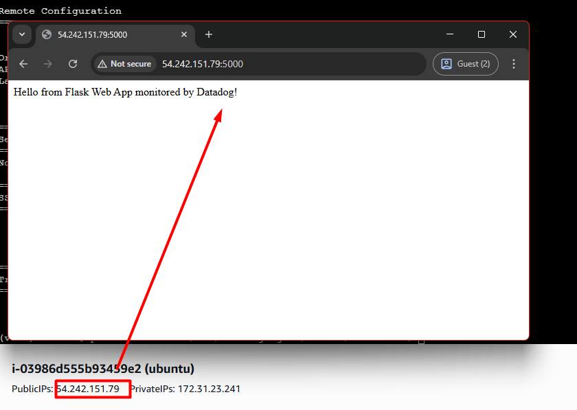
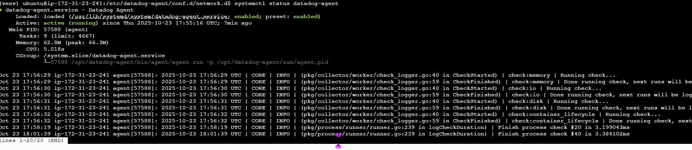
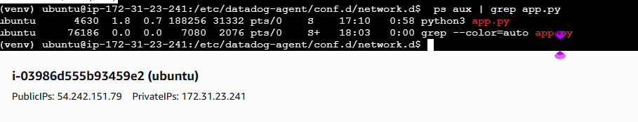
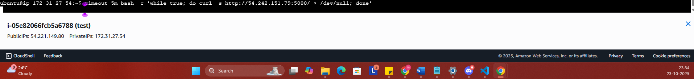
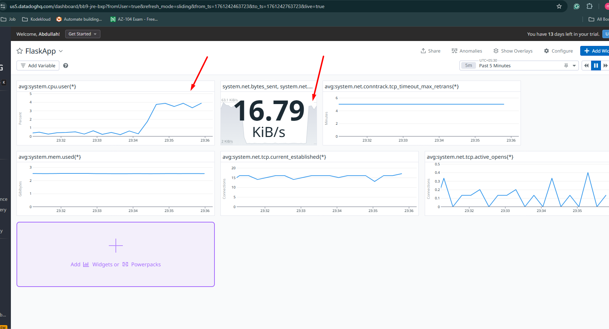

# 🚀 Datadog Monitoring Project — Deploy & Monitor a Sample Web App on AWS EC2

## 📘 Project Overview

This project demonstrates how to **deploy a sample web application on AWS EC2 (Ubuntu)** and monitor it end-to-end using **Datadog**.

You will:

- Deploy a Python Flask app on EC2
- Install and configure the Datadog Agent
- Create dashboards for performance and health metrics
- Validate monitoring through a live load test

* * *

## 🧩 Prerequisites

- AWS account with EC2 access
- Datadog account (API key required)
- SSH key pair for EC2
- Basic Linux command-line knowledge

* * *

## ⚙️ Step 1: Launch and Configure an EC2 Instance

1. **Login to AWS Console** → EC2 → *Launch Instance*
2. Choose **Ubuntu Server 22.04 LTS**
3. Select **t2.micro** (Free Tier)
4. Configure security group:

    - SSH → Port 22 → Your IP
    - HTTP → Port 80 → Anywhere (0.0.0.0/0)
    - Custom TCP → Port 5000 → Anywhere (0.0.0.0/0)
5. Launch and connect:

        ssh -i your-key.pem ubuntu@<EC2_PUBLIC_IP>

* * *

## 🌐 Step 2: Deploy a Sample Flask Web Application

1. **Install dependencies**

        sudo apt update -ysudo apt install python3 python3-pip python3-venv -y
2. **Create project directory**

        mkdir ~/sample-webapp && cd ~/sample-webapp
3. **Set up a virtual environment**

        python3 -m venv venvsource venv/bin/activate
4. **Install Flask**

        pip install flask
5. **Create the Flask app**

        nano app.py

    Paste the following:
```
 from flask import Flask
app = Flask(__name__)

@app.route('/')
def home():
    return "Hello from Flask Web App monitored by Datadog!"

if __name__ == '__main__':
    app.run(host='0.0.0.0', port=5000)

```
6. **Run the app**

        python3 app.py

    - Access via: `http://<EC2_PUBLIC_IP>:5000`

* * *

## 🐶 Step 3: Install and Configure Datadog Agent

1. **Set your Datadog API key**

        DD_API_KEY=<YOUR_DATADOG_API_KEY>DD_SITE="datadoghq.com" # Use datadoghq.eu if in EU
2. **Install the agent**

        sudo apt-get install -y curlcurl -L https://s3.amazonaws.com/dd-agent/scripts/install_script.sh | sudo DD_API_KEY=$DD_API_KEY DD_SITE=$DD_SITE bash
3. **Enable process and network monitoring**

        sudo sed -i 's/^# process_config:.*/process_config:\n enabled: "true"/' /etc/datadog-agent/datadog.yamlsudo sed -i 's/^# network_config:.*/network_config:\n enabled: true/' /etc/datadog-agent/datadog.yamlsudo systemctl restart datadog-agent
4. **Verify agent is running**

        sudo datadog-agent status

* * *


## ⚙️ Step 4: Run Flask App in Background (Persistent)

Keep Flask running even if you disconnect:

    nohup python3 app.py > app.log 2>&1 &

- Check running process:

        ps aux | grep app.py

- View logs:

        tail -f app.log

* * *

## 📊 Step 5: Create a Datadog Dashboard

Go to **Datadog → Dashboards → New Dashboard → Create Dashboard**

### Add These Widgets:

| Metric | Type | Query Example | Purpose |
| --- | --- | --- | --- |
| **CPU Utilization** | Timeseries | `avg:system.cpu.user` | Monitor CPU load |
| **Memory Usage** | Timeseries | `avg:system.mem.used{host:<ec2_name>}` | Check memory health |
| **Network Traffic (In/Out)** | Timeseries | `sum:system.net.bytes_sent{host:<ec2_name>}` and `sum:system.net.bytes_rcvd{host:<ec2_name>}` | Observe data flow |


💡 **Tip:** Add a Host Map widget to visually see your EC2 instance’s health.

* * *

## ⚙️ Step 6: Generate Traffic for Monitoring Validation

You can simulate real-world load to observe metric changes in Datadog.

### 🔸 Run for 5 minutes continuously:

    timeout 5m bash -c 'while true; do curl -s http://<EC2_PUBLIC_IP>:5000/ > /dev/null; done'


During these 5 minutes:

- CPU, memory, and network traffic will spike.
- Datadog dashboards will visualize real-time performance.
- Useful for demonstrating end-to-end observability.

* * *

## 🧠 Step 7: Validate in Datadog

- Go to **Infrastructure → Host Map**
Your EC2 should appear with live metrics.
- Go to **Metrics → Explorer**
Try searching:

    - `system.cpu.user`
    - `system.mem.used`
    - `system.net.bytes_sent`
- Check your **Dashboard** for graphs reacting to traffic load.

* * *

## 📈 Example Dashboard Parameters (Recommended)

Add these additional metrics to enrich your dashboard:

- **Disk usage:** `system.disk.used_percent`
- **Network latency:** `system.net.tcp.retrans_segs`
- **Load average:** `system.load.1`
- **System uptime:** `system.uptime`
- **Datadog Agent health:** `datadog.agent.up`
- **Custom App metric (optional):** `flask.request.count`

* * *

## 🧾 Summary

In this project, you:
✅ Deployed a Python Flask web app on AWS EC2
✅ Installed and configured the Datadog Agent
✅ Created rich dashboards for performance and resource monitoring
✅ Validated monitoring using a 5-minute synthetic load test

**Skills Demonstrated:**

- Cloud Infrastructure (AWS EC2)
- Python App Deployment
- Observability with Datadog
- Dashboard Design and Metric Analysis
- Linux Command-line Proficiency

* * *


