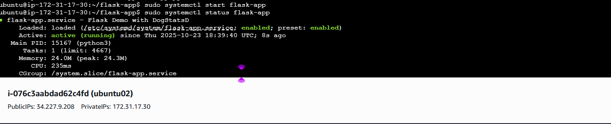

# Datadog Monitoring Project: Deploy and Monitor a Web Application on AWS EC2

## Introduction

This project demonstrates deploying a web application on AWS EC2 with comprehensive Datadog monitoring using **DogStatsD** - the industry-standard approach for application instrumentation.


---

## 1. Deploy the Sample Web Application

### 1.1 Set Up EC2 Instance

**Launch Instance:**

1. AWS Console → EC2 Dashboard → Launch Instance
2. Configure:
   - **Name:** `datadog-demo-app`
   - **AMI:** Ubuntu Server 22.04 LTS
   - **Instance type:** t2.micro or t3.micro
   - **Key pair:** Create/select one
   - **Security group:**
     - SSH (22) from your IP
     - HTTP (80) from anywhere
     - Custom TCP (5000) from anywhere
   - **Storage:** 8 GB


**Update System:**

```bash
sudo apt update
sudo apt upgrade -y
```

### 1.2 Deploy Flask Application with DogStatsD

**Install Dependencies:**

```bash
# Install Python
sudo apt install python3 python3-pip python3-venv -y

# Create virtual environment
python3 -m venv ~/flask-app-venv
source ~/flask-app-venv/bin/activate

# Install packages
pip install flask psutil datadog

deactivate
```
psutil datadog	The Python client library for the Datadog monitoring and analytics platform. This library is used to send metrics, traces, and logs from your application to Datadog's cloud-based service.

**Create Application:**

```bash
mkdir -p ~/flask-app
cd ~/flask-app
nano app.py
```

**Add Code (app.py):**

```python
from flask import Flask, jsonify, render_template_string, request, g
import psutil
import time
from datetime import datetime
from datadog import initialize, statsd

app = Flask(__name__)

# Initialize DogStatsD - connects to Datadog Agent on localhost:8125
initialize(statsd_host='127.0.0.1', statsd_port=8125)

metrics = {'total_requests': 0, 'endpoint_hits': {}, 'start_time': time.time()}

@app.before_request
def before_request():
    g.start_time = time.time()
    metrics['total_requests'] += 1
    statsd.increment('flask.app.requests.total', tags=[f'endpoint:{request.endpoint}', f'method:{request.method}'])

@app.after_request
def after_request(response):
    if hasattr(g, 'start_time'):
        duration = (time.time() - g.start_time) * 1000
        statsd.histogram('flask.app.request.duration', duration, tags=[f'endpoint:{request.endpoint}', f'status:{response.status_code}'])
        statsd.increment('flask.app.requests.status', tags=[f'status_code:{response.status_code}'])
    return response

@app.route('/')
def home():
    metrics['endpoint_hits']['home'] = metrics['endpoint_hits'].get('home', 0) + 1
    statsd.gauge('flask.app.endpoint.hits', metrics['endpoint_hits']['home'], tags=['endpoint:home'])
    uptime = int(time.time() - metrics['start_time'])
    statsd.gauge('flask.app.uptime', uptime)

    html = '''<!DOCTYPE html><html><head><title>Datadog Demo</title><style>
    body{font-family:Arial;margin:40px;background:#f5f5f5}
    .container{background:white;padding:30px;border-radius:8px;box-shadow:0 2px 4px rgba(0,0,0,0.1)}
    h1{color:#632CA6}.metric{background:#f9f9f9;padding:15px;margin:10px 0;border-left:4px solid #632CA6}
    a{color:#632CA6;text-decoration:none;margin-right:15px}a:hover{text-decoration:underline}
    .badge{background:#632CA6;color:white;padding:4px 8px;border-radius:4px;font-size:12px}
    </style></head><body><div class="container">
    <h1>🚀 Datadog Monitoring Demo</h1>
    <p>Instrumented with <span class="badge">DogStatsD</span> for real-time monitoring.</p>
    <div class="metric"><strong>Total Requests:</strong> {{ total_requests }}</div>
    <div class="metric"><strong>Uptime:</strong> {{ uptime }} seconds</div>
    <div class="metric"><strong>Monitoring:</strong> DogStatsD (Real-time streaming)</div>
    <h2>Endpoints:</h2><p>
    <a href="/">Home</a><a href="/api/metrics">Metrics</a>
    <a href="/api/health">Health</a><a href="/api/load">Load Test</a></p>
    <hr style="margin:30px 0"><p style="font-size:14px;color:#666">
    💡 All requests tracked and sent to Datadog in real-time!</p>
    </div></body></html>'''
    return render_template_string(html, total_requests=metrics['total_requests'], uptime=uptime)

@app.route('/api/health')
def health():
    metrics['endpoint_hits']['health'] = metrics['endpoint_hits'].get('health', 0) + 1
    statsd.gauge('flask.app.endpoint.hits', metrics['endpoint_hits']['health'], tags=['endpoint:health'])
    statsd.increment('flask.app.health.check', tags=['status:healthy'])
    return jsonify({'status': 'healthy', 'timestamp': datetime.now().isoformat(), 'uptime_seconds': int(time.time() - metrics['start_time'])})

@app.route('/api/metrics')
def get_metrics():
    metrics['endpoint_hits']['metrics'] = metrics['endpoint_hits'].get('metrics', 0) + 1
    statsd.gauge('flask.app.endpoint.hits', metrics['endpoint_hits']['metrics'], tags=['endpoint:metrics'])
    cpu = psutil.cpu_percent(interval=1)
    mem = psutil.virtual_memory()
    statsd.gauge('flask.app.system.cpu_percent', cpu)
    statsd.gauge('flask.app.system.memory_percent', mem.percent)
    return jsonify({'application': {'total_requests': metrics['total_requests'], 'endpoint_hits': metrics['endpoint_hits'], 'uptime_seconds': int(time.time() - metrics['start_time'])},
                    'system': {'cpu_percent': cpu, 'memory_percent': mem.percent, 'memory_used_mb': mem.used / (1024 * 1024), 'memory_total_mb': mem.total / (1024 * 1024)},
                    'monitoring': {'method': 'DogStatsD', 'endpoint': '127.0.0.1:8125'}})

@app.route('/api/load')
def simulate_load():
    metrics['endpoint_hits']['load'] = metrics['endpoint_hits'].get('load', 0) + 1
    statsd.gauge('flask.app.endpoint.hits', metrics['endpoint_hits']['load'], tags=['endpoint:load'])
    statsd.increment('flask.app.load.simulation', tags=['type:cpu'])
    result = sum(i ** 2 for i in range(1000000))
    return jsonify({'message': 'Load complete', 'result': result, 'note': 'CPU spike sent to Datadog'})

@app.errorhandler(404)
def not_found(error):
    statsd.increment('flask.app.errors', tags=['error_type:404'])
    return jsonify({'error': 'Not found'}), 404

@app.errorhandler(500)
def internal_error(error):
    statsd.increment('flask.app.errors', tags=['error_type:500'])
    return jsonify({'error': 'Internal server error'}), 500

if __name__ == '__main__':
    statsd.event(title='Flask App Started', message='DogStatsD monitoring started', tags=['env:demo', 'app:flask-demo'])
app.run(host='0.0.0.0', port=5000, debug=False)
```

Save (Ctrl+X, Y, Enter).

**Create Systemd Service:**

```bash
sudo nano /etc/systemd/system/flask-app.service
```

Add:

```ini
[Unit]
Description=Flask Demo with DogStatsD
After=network.target

[Service]
User=ubuntu
WorkingDirectory=/home/ubuntu/flask-app
Environment="PATH=/home/ubuntu/flask-app-venv/bin"
ExecStart=/home/ubuntu/flask-app-venv/bin/python3 /home/ubuntu/flask-app/app.py
Restart=always
RestartSec=10

[Install]
WantedBy=multi-user.target
```

**Start Application:**

```bash
sudo systemctl daemon-reload
sudo systemctl enable flask-app
sudo systemctl start flask-app
sudo systemctl status flask-app
```

**Verify:**

```bash
curl http://localhost:5000
curl http://localhost:5000/api/health
```

Access: `http://your-ec2-ip:5000`

---

## 2. Install and Configure Datadog Agent

### 2.1 Get API Key

1. Log in: https://app.datadoghq.com
2. Navigate: **Organization Settings** → **API Keys**
3. Copy your API key
4. Note your site (datadoghq.com, datadoghq.eu, us3.datadoghq.com, etc.)

### 2.2 Install Agent

```bash
# Set credentials
DD_API_KEY=<> \
DD_SITE="us5.datadoghq.com" \
DD_REMOTE_UPDATES=true \
DD_ENV=staging \
bash -c "$(curl -L https://install.datadoghq.com/scripts/install_script_agent7.sh)"
```

The agent:
- Installs Datadog Agent v7
- Configures your API key
- Starts the service
- **Enables DogStatsD by default** (UDP port 8125)

**Verify:**

```bash
sudo datadog-agent status
sudo datadog-agent status | grep -A 5 "dogstatsd"
```

### 2.3 Configure Agent

**Enable Process Monitoring:**

```bash
sudo nano /etc/datadog-agent/datadog.yaml
```

Add at end:

```yaml
process_config:
  process_collection:
    enabled: true

tags:
  - env:stagging
  - app:flask-demo
  - monitoring:dogstatsd
```

**Enable Logs (Optional):**

In same file:

```yaml
logs_enabled: true
```

Then:

```bash
sudo mkdir -p /etc/datadog-agent/conf.d/flask-app.d
sudo nano /etc/datadog-agent/conf.d/flask-app.d/conf.yaml
```

Add:

```yaml
logs:
  - type: file
    path: /var/log/syslog
    service: flask-app
    source: python
    tags:
      - env:stagging
```

**Restart Agent:**

```bash
sudo systemctl restart datadog-agent
sleep 5
sudo datadog-agent status
```

**Verify Metrics:**

```bash
# Generate traffic
for i in {1..10}; do curl -s http://localhost:5000/ > /dev/null; done

# Wait
sleep 30

# Check DogStatsD
sudo datadog-agent status | grep -A 10 "DogStatsD"
```

Should show:
- Packets received > 0
- Metrics parsed > 0
- No errors

---

## 3. Create Datadog Dashboards

### 3.1 Create Dashboard

1. Login: https://app.datadoghq.com
2. **Dashboards** → **New Dashboard**
3. Name: "Flask Application Monitoring - DogStatsD"
4. Choose: **Timeboard**

### 3.2 Add Widgets

#### Widget 1: Request Rate

1. **Add Widget** → **Timeseries**
2. Metric: `flask.app.requests.total`, Sum
3. **Add Query**: Apply `per_minute()`
4. Title: "Request Rate (per minute)"
5. Save

#### Widget 2: Requests by Endpoint

1. **Timeseries**
2. Metric: `flask.app.requests.total`
3. Group by: `endpoint`
4. Apply: `per_minute()`
5. Display: Area, Stacked
6. Title: "Requests by Endpoint"
7. Save

#### Widget 3: Request Duration

1. **Timeseries**
2. Add 3 queries:
   - `flask.app.request.duration.avg`
   - `flask.app.request.duration.95percentile`
   - `flask.app.request.duration.max}`
3. Title: "Latency (ms) - Avg, P95, Max"
4. Y-axis: "Milliseconds"
5. Save

#### Widget 4: HTTP Status Codes

1. **Timeseries**
2. Metric: `flask.app.requests.status`
3. Group by: `status_code`
4. Display: Bars, Stacked
5. Title: "HTTP Status Codes"
6. Save

#### Widget 5: Uptime

1. **Query Value**
2. Metric: `flask.app.uptime`, Avg
3. Format: Number, Unit: seconds
4. Title: "Application Uptime"
5. Save

#### Widget 6: CPU Usage

1. **Timeseries**
2. Add queries:
   - `avg:system.cpu.user{*}`
3. Display: Area, Stacked
4. Title: "CPU Utilization"
5. Save


**Network:**
- Timeseries
- Metrics: `system.net.bytes_rcvd`, `system.net.bytes_sent`
- Title: "Network Traffic"

**Load Average:**
- Timeseries
- Metrics: `system.load.1`, `system.load.5`, `system.load.15`
- Title: "Load Average"

**TCP Connections:**
- Timeseries
- Metric: `system.net.tcp.current_established`
- Title: "Active Connections"

**Disk:**
- Query Value
- Metric: `system.disk.in_use`
- Format: Percentage
- Title: "Disk Usage"

**Errors:**
- Query Value
- Metric: `flask.app.errors`, Sum
- Title: "Total Errors"
- Conditional: Green = 0, Red > 0

---

## 4. Demonstrate Monitoring

### 4.1 Verify Collection

**Datadog UI:**
1. **Metrics** → **Explorer**
2. Search: `flask.app.requests.total`, `flask.app.request.duration`
3. Verify recent data


### 4.3 Observe Dashboards

Monitor these panels:

**Request Rate:**
- Steady increase during load
- Spikes during Apache Bench
- Rate shows bursts of activity

**Endpoint Distribution:**
- Home: Highest volume
- Health: Steady stream
- Load: Occasional spikes

**Latency:**
- Avg: 10-30ms
- P95: 40-100ms
- Max: 500-2000ms for load endpoint

**Status Codes:**
- 200: Dominant (99-100%)
- No 4xx/5xx errors

**CPU:**
- Idle: 1-5% normally
- Spikes: 60-90% during load
- Quick return to baseline

**Memory:**
- Stable: 300-450 MB
- 30-45% on t2.micro
- No continuous growth


---

**Project Complete! 🎉**

You now have a **production-grade, real-time monitoring solution** using **DogStatsD** - the industry standard for application instrumentation!

**Happy monitoring!** 📊🚀
