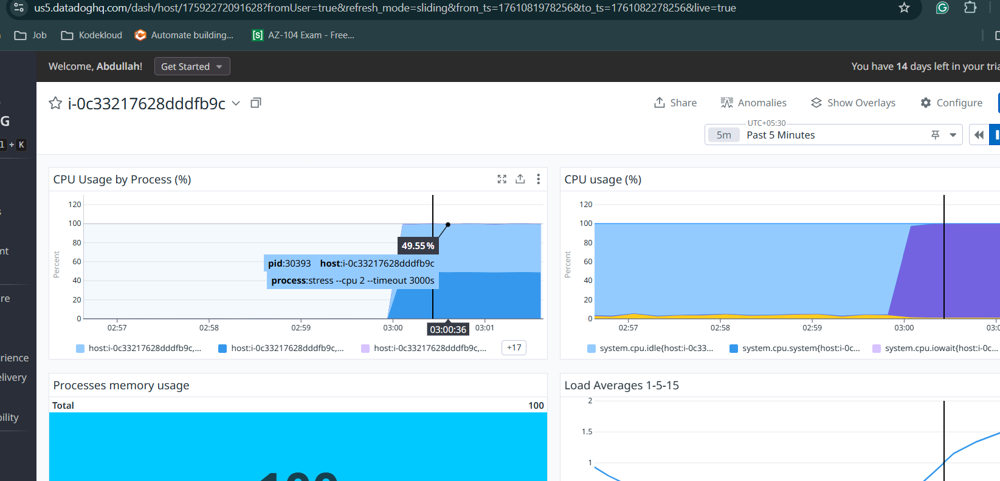

# Datadog Integration with Ubuntu EC2

A technical guide for installing Datadog Agent on Ubuntu EC2, monitoring CPU metrics, and configuring alerts, and identifying the high CPU process.

## Prerequisites

- Ubuntu EC2 instance ( with sudo access
- Datadog account and API key from [Datadog API Keys page](https://app.datadoghq.com/organization-settings/api-keys)
- SSH access to EC2 instance

## 1. Datadog Agent Installation

### Install Agent via APT
```bash
# Set your Datadog API key
DD_API_KEY=<key> \
DD_SITE="us5.datadoghq.com" \
DD_REMOTE_UPDATES=true \
DD_APM_INSTRUMENTATION_ENABLED=host \
DD_DATA_STREAMS_ENABLED=true \
DD_PROFILING_ENABLED=auto \
DD_ENV=dev \
DD_APM_INSTRUMENTATION_LIBRARIES=java:1,python:3,js:5,php:1,dotnet:3,ruby:2 \
bash -c "$(curl -L https://install.datadoghq.com/scripts/install_script_agent7.sh)"  # Use datadoghq.eu for EU region

# Download and run the installation script
DD_API_KEY=$DD_API_KEY DD_SITE=$DD_SITE bash -c "$(curl -L https://s3.amazonaws.com/dd-agent/scripts/install_script_agent7.sh)"
```

### Verify Installation
```bash
# Check agent status
sudo datadog-agent status

# Verify agent is running
sudo systemctl status datadog-agent
```


### Configure Hostname (Optional)
```bash
# Edit agent configuration
sudo nano /etc/datadog-agent/datadog.yaml

# Set custom hostname (uncomment and modify):
# hostname: my-ec2-instance

# Restart agent
sudo systemctl restart datadog-agent
```

## Enable Process Agent

The Datadog Process Agent collects detailed process metrics. It's included with the Agent but needs to be enabled.

### Edit Datadog Configuration

```bash
# Edit main configuration file
sudo nano /etc/datadog-agent/datadog.yaml
```

Add or modify these settings:

```yaml
# Enable process collection
process_config:
  enabled: "true"

# Optional: Configure process discovery
process_dd_url: https://process.datadoghq.com

# Enable container process collection (if using Docker)
container_collect_all: true
```

### Restart Datadog Agent

```bash
sudo systemctl restart datadog-agent
```

## 2. CPU Load Generation

### Install Stress Testing Tools
```bash
# Install stress utility
sudo apt-get update
sudo apt-get install -y stress

# Alternative: Install sysbench
sudo apt-get install -y sysbench
```

### Generate CPU Load

**Using `stress`:**
```bash
# Generate 100% CPU load on all cores for 5 minutes
stress --cpu $(nproc) --timeout 300s

```


## 3. Dashboard Setup

### Access Datadog Dashboard

1. Navigate to [Datadog Dashboards](https://app.datadoghq.com/dashboard/lists)
2. Click **New Dashboard**
3. Name: `EC2 CPU Monitoring`

### Add CPU Metrics Widget

**Via UI:**
1. Click **Add Widget** → **Timeseries**
2. Select metric: `system.cpu.user` or `system.cpu.system`
3. Filter by: `host:<YOUR_HOSTNAME>`
4. Click **Save**


This enables the built-in “Process Check” for the Agent.

## 4. Alert Configuration

### Create CPU Alert Monitor

**Via UI:**
1. Go to [Monitors → New Monitor](https://app.datadoghq.com/monitors/create)


- In the Datadog UI go to **Monitors → New Monitor → Metric**. [Datadog]
- Configure as follows:

- **Metric**: `system.cpu.user` (or choose `system.cpu.system` / `100 - system.cpu.idle`)
- **Scope**: `host:${HOSTNAME}`
- **Condition**: `avg(last_5m) > 80`
- **Name**: “High CPU on ${HOSTNAME}”




## as we can see below that the Stress process is making the high CPU


## Troubleshooting
```bash
# View agent logs
sudo tail -f /var/log/datadog/agent.log

# Check connectivity
sudo datadog-agent diagnose

# Restart agent
sudo systemctl restart datadog-agent

# Force metric submission
sudo datadog-agent check cpu
```

## Cleanup
```bash
# Stop load generation
killall stress sysbench dd

# Uninstall agent (optional)
sudo apt-get remove --purge datadog-agent -y
sudo rm -rf /etc/datadog-agent /opt/datadog-agent /var/log/datadog
```

## Additional Resources

- [Datadog Agent Documentation](https://docs.datadoghq.com/agent/)
- [Datadog API Reference](https://docs.datadoghq.com/api/latest/)
- [System Check Metrics](https://docs.datadoghq.com/integrations/system/)